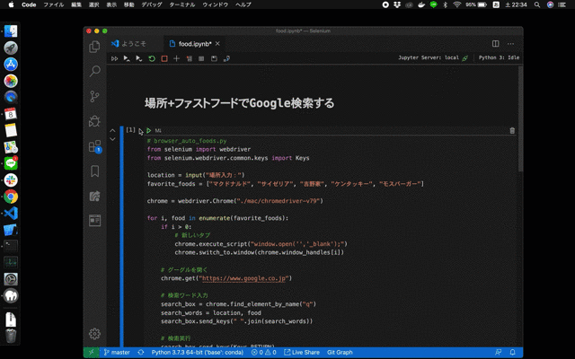

# DEMO

<p align="center">

</p>

# OVERVIEW

When you enter a place in the input field, the search for the typical fast food restaurant in that place is automatically performed by chrome. Also, the next line of code will automatically find the fast food store at your current location. It uses [GeoJS API](https://opengeoscience.github.io/geojs/) to get the current location.

# USAGE

```terminal
git clone https://github.com/Alesion30/selenium.git
cd selenium
jupyter notebook
```

If your PC is Windows or Linux, you need to download chromedriver from the site below.

https://chromedriver.chromium.org/downloads